# hse21_hw3
Ссылка на первую часть задания: https://colab.research.google.com/drive/1hV1q4tGtv-PgT5a6Wn2UEn9MGnLufYbq?usp=sharing  
Ссылка на вторую часть задания: https://colab.research.google.com/drive/1qHSfgHSB95JEEnqlI0K5mZ8N0-jTu-4O?usp=sharing 
  
Таблица  
ID | Тип | Исходных чтений | Успешно откартированных чтений | Успешно откартированных чтений (%) | Уникально откартированных чтений | Уникально откартированных чтений (%) | Чтений, попавших на гены  
---- | ----- | ----- | ----- | ---- | ----- | ----- | -----   
SRR3414635 | control | 20956475 | 20395865 | 97,32 | 18428317 | 87,94 | 16275997  
SRR3414636 | control | 20307147 | 19757059 | 97,29 | 17825380 | 87,78 | 15757580  
SRR3414637 | control | 20385570 | 19847391 | 97,36 | 17844858 | 87,54 | 15736978  
SRR3414629 | reprogrammed | 21106089 | 20510113 | 97,17 | 18375888 | 87,06 | 16049609  
SRR3414630 | reprogrammed | 15244711 | 14832680 | 97,3 | 13186139	| 86,5 | 11465324  
SRR3414631 | reprogrammed | 24244069 | 23547686 | 97,13 | 20928945 | 86,33 | 18408851  
  
Результаты проверок FastQC:  
SRR3414629  
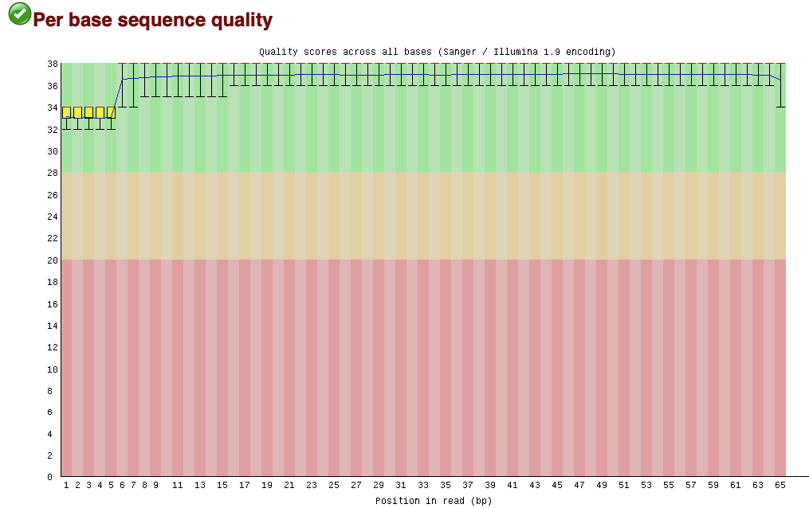  
SRR3414630  
  
SRR3414631  
  
SRR3414635  
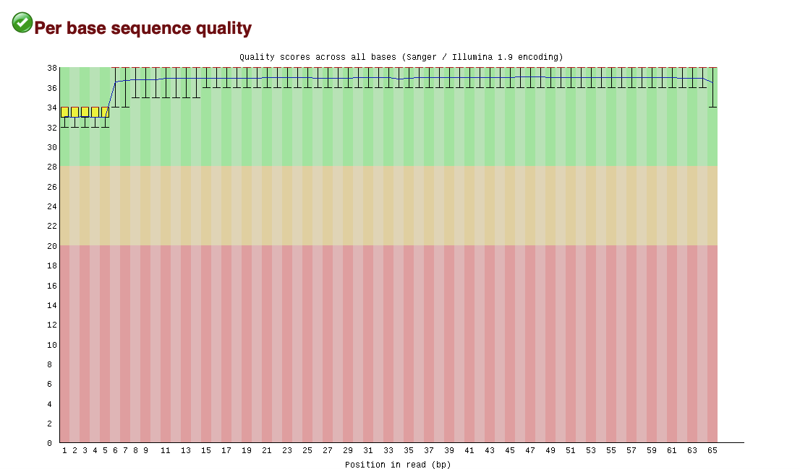  
SRR3414636  
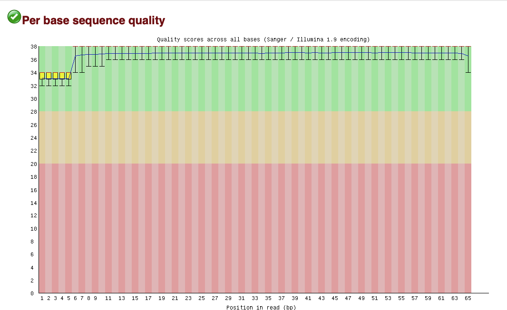  
SRR3414637  
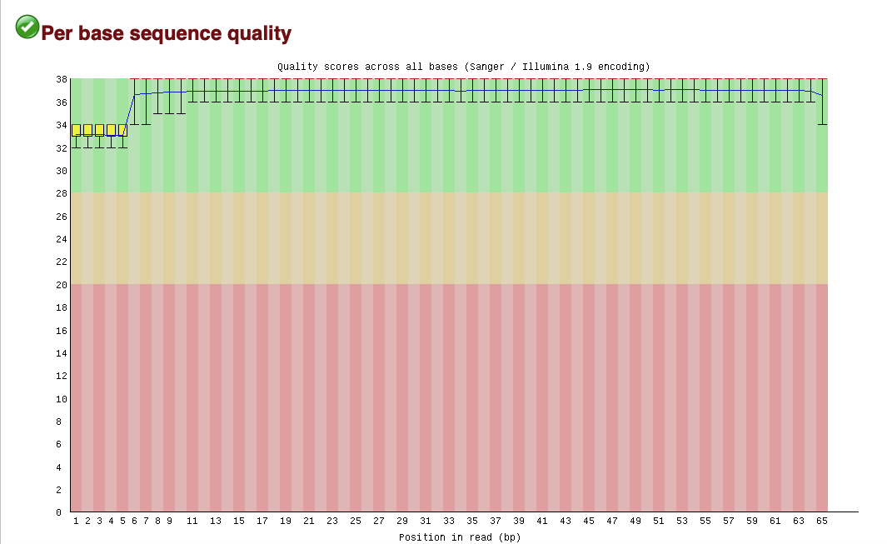  
  
MA plot  
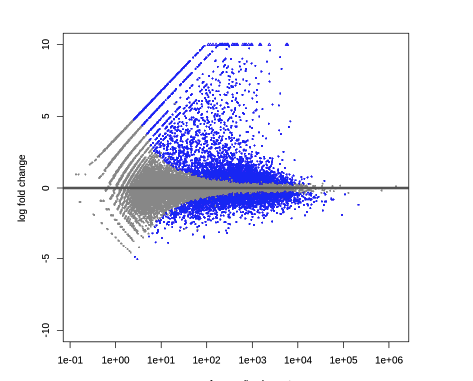  
Тепловая карта  
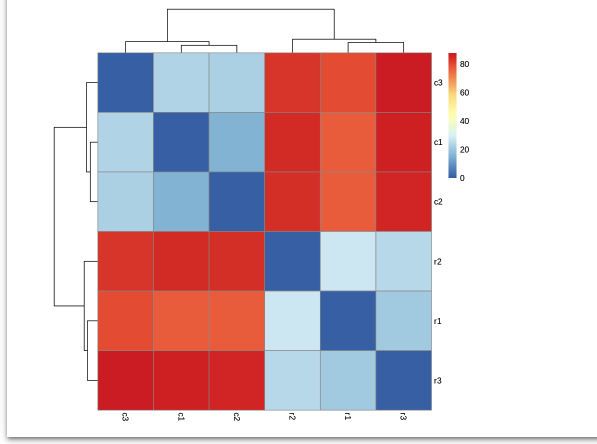  
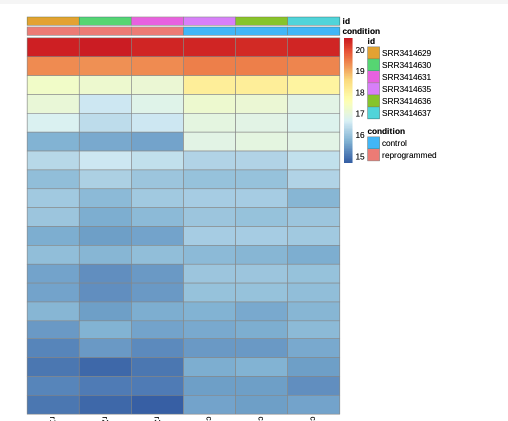  
Графики Normalized counts  
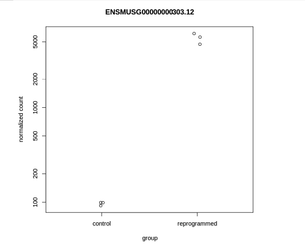  
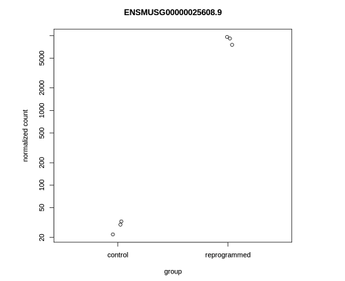  
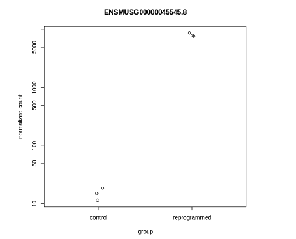  
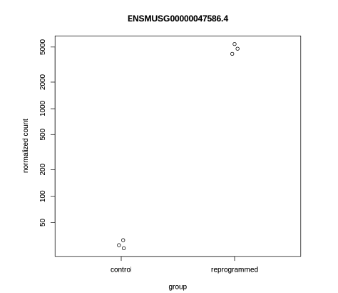  
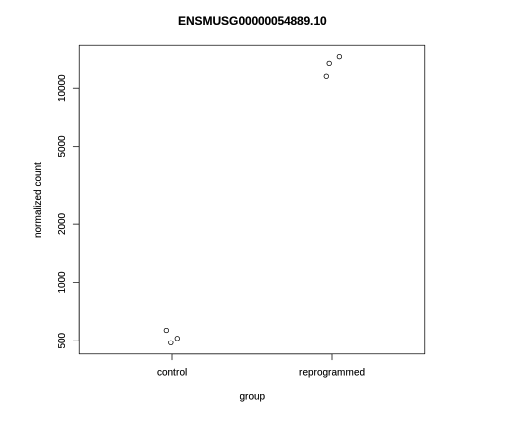  
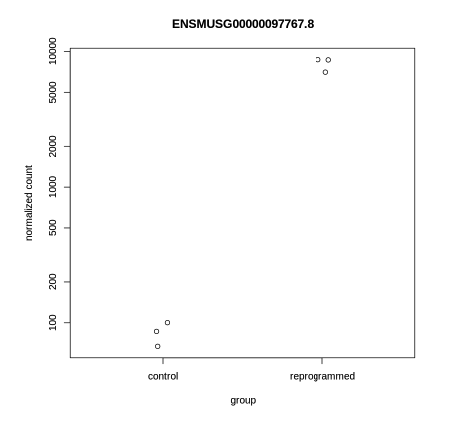  
